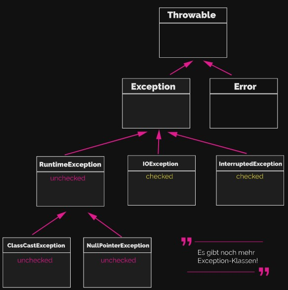
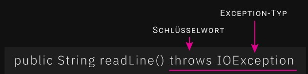
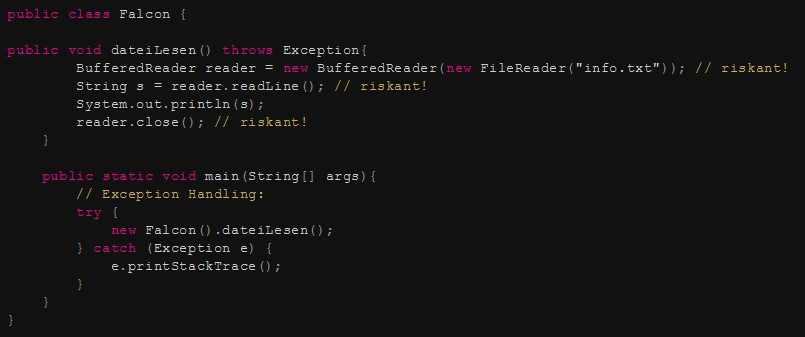

# DAO
Data Access Object (Datenzugriffsobjekt)\
Ein Entwurfsmuster, das den Zugriff auf unterschiedliche Arten von Datenquellen (z.B. Datenbanken, Dateisystem) so kapselt, dass die angesprochene Datenquelle ausgetauscht werden kann, ohne dass der aufrufende Code geändert werden muss.\
Trennung von Programmlogik und Datenspeicherung -> Erhöhung der Flexibilität.\
DAO ist ein Muster für die Gestaltung von Programmierschnittstellen (APIs). Wenn eine Programmiersprache keine Trennung von Schnittstellendefinition und -implementierung ermöglicht, muss ein DAO die definierte Schnittstelle unmittelbar implementieren.

## Eigenschaften
* DAOs abstrahieren den Zugriff auf DBs nicht vollständig, da sie nicht für die Transformation der Daten in die Struktur der Datenbank verantwortlich sind
* DAOs sind jeweils für ein spezielles Speichermedium optimiert. Der Zugriff auf dieses Medium wird über das vom DAO vorgegebene bzw. zu implementierende API vorgenommen.
* DAOs minimieren den Portierungsaufwand einer Anwendung beim Wechsel des Speichermediums.\

Eng verwandt mit dem DAO ist das Entwurfsmuster Transferobjekt. Dieses übernimmt im Zusammenspiel mit dem DAO die Transformation der aus der Datenquelle kommenden Daten in die von der Applikation gewünschte Form. Bei der objektrelationalen Abbildung werden so objektorientierte Daten in relationale Form transformiert.

# Objektrelationales Mapping
Objektrelationale Abbildung
Eine Technik der Softwareentwicklung, mit der ein in einer objektorientierte Programmiersprache geschriebenes Anwendungsprogramm seine Objekte in einer relationalen Datenbank ablegen kann. Dem Programm erscheint die DB dann als objektorientierte Datenbank, was die Programmierung erleichtert.

## Prinzip
Objektorientierte Programmiersprachen (OOP) kapseln Daten und Verhalten in Objekten, hingegen legen relationale Datenbanken Daten in Tabellen ab. Die beiden Paradigmen sind grundlegend verschieden. So kapseln Objekte ihren Zustand und ihr Verhalten hinter einer Schnittstelle und haben eine eindeutige Identität. Relationale Datenbanken basieren dagegen auf dem mathematischen Konzept der relationalen Algebra.\
Um den Widerspruch aufzulösen oder zumindest zu mildern, wurden verschiedene Lösungen vorgeschlagen, beispielsweise objekorientierte Datenbanken oder die Erweiterung von Programmiersprachen um relationale Konzepte (z.B. Embedded SQL). Die direkte objektrelationale Abbildung von Objekten auf Relationen hat den Vorteil, dass einerseites die Programmiersprache selbst nicht erweitert werden muss und andererseits relationale Datenbanken als etablierte Technik in allen Umgebungen als ausgereifte Software verfügbar sind.

## Grundlegende Techniken
Im einfachsten Fall werden Klassen auf Tabellen abgebildet, jedes Objekt entspricht einer Tabellenzeile und für jedes Attribut wird eine Tabellenspalte reserviert. Die Identität eines Objekts entspricht dem Primärschlüssel der Tabelle. Hat ein Objekt eine Referenz auf ein anderes Objekt, so kann diese mit einer Fremdschlüssel-Primärschlüssel-Beziehung in der Datenbank dargestellt werden.

## Abbildung von Vererbungshierarchien
* Tabelle pro Vererbungshierarchie (Single Table)
* Tabelle pro Unterklasse (Class Table)
* Tabelle pro konkreter Klasse (Table per Class oder Concrete Table)

# Singleton-Pattern
Einzelstück
Entwurfsmuster (Erzeugungsmuster). Stellt sicher, dass von einer Klasse genau ein Objekt existiert. Dieses Singleton ist darüber hinaus üblicherweise global verfügbar.

## Verwendung
* Wenn nur ein Objekt einer Klasse existieren darf und ein einfacher Zugriff auf dieses Objekt benötigt wirde oder
* das einzige Objekt durch Unterklassenbildung spezialisert werden soll

## Eigenschaften
* erzeugt und verwaltet das einzige Objekt der Klasse
* bietet globalen Zugriff auf dieses Objekt über eine Instanzoperation (getInstance())\

Dabei ist
* die Instanzoperation ein Klassenmethode, das heißt statisch gebunden
* das private Attribut "Instanz" (singelton) ein Klassenattribut, das heißt ein statisches Attribut

## Vorteile
* Zugriffskontrolle kann realisiert werden
* Singleton kann durch Unterklassenbildung spezialisiert werden
* Welche Unterklasse verwendet werden soll, kann zur Laufzeit entschieden werden
* Die Einzelinstanz muss nur erzeugt werden, wenn sie benötigt wird
* Sollten später mehrere Objekte benötigt werden, ist eine Änderung leichter möglich als bei globalen Variablen

## Nachteile
* Gefahr durch exzessive Verwendung
* Abhängigkeiten zur Singleton-Klasse werden verschleiert. Kopplung wird erhöht, was Wiederverwendbarkeit und Übersichlichkeit einschränkt.
* "Scope" des Singletons, also der Bereich, in dem ein Singleton auch wirklich technisch "einzeln" ist, muss nicht mit dem Bereich zusammenfallen, in dem es "einzeln" sein soll.
* Testung kann kompliziert sein.

# Exceptions
Arten von Exceptions.

## Unchecked Exceptions
Alle Klassen, die "RuntimeException" erweitern, sind unchecked Exceptions. Sie werden "unchecked" (ungeprüft) genannt, weil der Compiler für diese zur Übersetzungszeit keine Überprüfung vornimmt.\
Die meisten Runtime Exceptions resultieren aus Situationen, die vermeidbar gewesen wären, d.h. sie gehen zumeist auf logische Programmierfehler zurück. Es ist nicht die Aufgabe des Compilers, Sie hierbei zu unterstützen. Deshalb werden sie in Ihrer Programmierumgebung nicht als Fehler angezeigt und der Compiler lässt sie ohne Prüfung "unter dem Radar" durchgehen. Ein compilierbares Programm ist also nicht gleich auch fehlerfrei.

## Checked Exceptions
Alle Exceptions, die nicht Unterklassen von RuntimeException sind, gehören zur Gruppe der checked Exceptions. Was bedeutet das, wenn eine Exception als "checked" definiert ist?\
Checked Exceptions sind "geprüfte" Exceptions, das heißt, dass der Compiler zur Übersetzungszeit eine Prüfung in Form eines try-catch-Mechanismus vom Programmierer einfordert. Fehlt das entsprechende Exception-Handling, ist der Code nicht compilierbar. Wir müssen also bestätigen, dass wir uns des Risikos eines bestimmten Methodenaufrufs bewusst sind. Eben das ist der Unterschied zu den RuntimeExceptions: Diese werden vom Compiler ignoriert und auch ohne Exception-Handling "ungeprüft" (unchecked) durchgelassen.\
Checked Exceptions sind für Fälle gedacht, in denen wir damit rechnen sollten, dass etwas schieflaufen könnte. Wenn wir zum Beispiel eine Datei schreiben wollen, können wir nicht garantieren, dass die Datei z.B. nicht schreibgeschützt ist. Das liegt außerhalb der "Macht" unseres Programms. In solchen Fällen werden wir als Programmierer vom Compiler "gezwungen", den Erfolg des riskanten Vorhabens zu überprüfen.\

### Beispiele:
* FileNotFoundException
* IOException
* SQLException

## Handling
Anhand der Methodendeklaration der Java-API können wir ablesen, ob eine Methode eine checked Exception werfen kann - und falls ja: um welchen Exception-Typ es sich handelt. Am Beispiel der Methode readLine() sieht das so aus:

Neu ist das Schlüsselwort throws ("wirft"), das anzeigt, dass die Methode eine checked Exception werfen kann. Dahinter steht die Klasse des Exception-Typs.\
Halten wir also fest:
* Methoden, die mit dem Schlüsselwort throws deklariert sind, sind immer riskant.
* Sie können checked Exceptions werfen.
* Exceptions, die durch diese Methoden ausgelöst werden können, müssen zur Compilierzeit in jedem Fall behandelt werden.

### Exception weiterwerfen
Bisher haben wir riskante Methoden immer direkt mit einem try-catch-Block umgeben. Exceptions müssen aber nicht "an Ort und Stelle" behandelt werden. Alternativ können wir die Exception auch "weiterwerfen".\

Wie wir sehen, behandelt die Methode dateiLesen() den riskanten Code nicht (es gibt kein try-catch-Statement). Was aber auffällt, ist, dass die Methodendeklaration von dateiLesen() um throws Exception erweitert wurde. Das bedeutet, dass die Exception an diejenige Methode weitergeworfen wird, die dateiLesen() aufruft. In unserem Beispiel ist das die Main-Methode - und genau hier findet das Exception Handling dann auch statt.\
Wir können die Behandlung von checked Exceptions auf andere Methoden auf dem Stack auslagern, aber auslassen können wir sie nicht. Der Compiler fordert für den riskanten Code unbedingt ein Exception-Handling. Entweder direkt oder über das Weiterwerfen via throws-Deklaration.

# Abstrakte Klassen
Eine Klasse die sich nicht instanziieren lässt, d.h. es lassen sich keine Objekte von ihr erzeugen, und dient somit lediglich als Strukturelement innerhalb einer Klassenhierarchie.\
Als Basisklassen in einer Klassenhierarchie können abstrakte Klassen grundlegende Eigenschafte ihrer abgeleiteten Klassen festlegen, ohne diese bereits konkret zu implementieren. Leitet eine Klasse von einer abstrakten Klasse ab, müssen alle vererbten abstrakten Methoden überschrieben und implementiert werden, damit die erbende Klasse selbst nicht abstrakt ist.\
Abstrakte Klassen können nicht selbst instanziiert werden, nur Spezialisierungen von diesen. Dennoch können Teile des Quelltextes allgemein gehalten und nur unter Verwendung der Eigenschaften des abstrakten Basistyps implementiert werden. Durch Polymorphie kommen dabei die speziellen Implementierungen der nicht abstrakten abgeleiteteten Klassen zur Ausführung.

# Interfaces
(Schinttstelle)
Softwareschnittstellen oder softwareseitige Datenschnittstellen sind logische Berührungspunkte in einem Softwaresystem: Sie ermöglichen und regeln den Austausch von Kommandos und Daten zwischen verschiedenen Prozessen und Komponenten. In der Software benutzte Schnittstellen lassen sich grundsätzlich unterscheiden in:\
* Nur zur Kommunikation benutzte, datenorientierte Schnittstellen: Hierbei bleibt die Schnittstelle immer 'passiv', sie enthält lediglich die Informationen, die zwischen beteiligten Systemteilen ausgetauscht werden. Beispiel: Adressübergaben mit Verweis auf zu verwendende Daten/Informationen bei Aufruf von Unterprogrammen.
* Schnittstellen als funktionale Einheiten: Die so benutzten Schnittstellen führen eine bestimmte Funktionalität aus, um die primär beteiligten Systemteile zu synchronisieren oder zu unterstützen.

