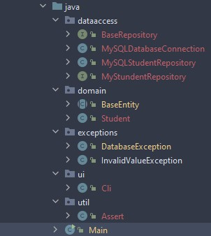

# Aufbau



## dataaccess

Für die Interaktion mit der DB verantwortlich.

### MySQLDatabaseConnection

Stellt die Verbindung zu der DB her.

```java
private static Connection con = null;

    private MySQLDatabaseConnection(){}

    public static Connection getConnection(String url, String user, String pwd) throws ClassNotFoundException, SQLException {
        if (con != null){
            return con;
        } else {
            Class.forName("com.mysql.cj.jdbc.Driver");
            con = DriverManager.getConnection(url, user, pwd);
            return con;
        }
    }
}
```
Wenn schon mal eine Connection erstellt wurde, wird diese Returniert. Ansonsten wird eine neue Connection eingerichtet und zurück gegeben.


### BaseRepository

Interface mit allen CRUD-Operationen die in jeder Entität vorhanden sein müssen.

```java
public interface BaseRepository <T, I>{
    Optional<T> insert(T entity);
    Optional<T> getById(I id);
    List<T> getAll();
    Optional<T> update(T entity);
    void deleteById(I id);
}
```

### MyStudentRepository

Interface das das BaseRepository um Entitätsspezifische Methoden erweitert.

```java
public interface MyStundentRepository extends BaseRepository<Student, Long>{
    List<Student> findByLastName(String name);
    List<Student> findByFirstName(String name);
}
```

### MySQLStudentRepository

Implementiert das MyStudentRepo-Interface.

Hat ein Connection Datenfeld das im Konstruktor initialisiert wird.

```java
private Connection con;

    public MySQLStudentRepository() throws SQLException, ClassNotFoundException {
        this.con = MySQLDatabaseConnection.getConnection("jdbc:mysql://localhost:3306/jdbc_meins01", "root", "");
    }

```

In den Methoden werden die einzelnen SQL-Statements angegeben und in PreparedStatements gespeichert. z.B.:
```java
String sql = "INSERT INTO `students` (`firstName`, `lastName`, `dateOfBirth`) VALUES(?,?,?)";
PreparedStatement preparedStatement = con.prepareStatement(sql, Statement.RETURN_GENERATED_KEYS);
```

In das PreparedStatement werden mittels Settern die einzelnen Fragezeichen im SQL-Statement befüllt. z.B.:

```java
preparedStatement.setString(1, entity.getFirstName());
preparedStatement.setString(2, entity.getLastName());
preparedStatement.setDate(3, entity.getDateOfBirth());
```

Mit preparedStatement.executeQuery()/executeUpdate() wird das PreparedStatement ausgeführt.
Zurück kommt ein ResultSet. \
Mittels resultSet.getLong()/getString()/getDate() können die Werte der einzelnen Spalten ausgelesen werden.

```java
resultSet.next();

Student student = new Student(
        resultSet.getLong("id"),
        resultSet.getString("firstName"),
        resultSet.getString("lastName"),
        resultSet.getDate("dateOfBirth")
);
```

## domain

In diesem Package befinden sich alle Domänen der Anwendung.

### BaseEntity

Eine abstrakte Klasse, die die ID und deren Getter und Setter beinhaltet.

```java
public abstract class BaseEntity {

    private Long id;

    public BaseEntity(Long id){ setId(id);}

    public Long getId(){ return this.id;}

    public void setId(Long id){
        if (id==null || id >= 0){
            this.id = id;
        } else {
            throw new InvalidValueException("Student-ID muss größer gleich 0 sein!");
        }
    }
```

### Student

Erweitert die BaseEntity und ergänzt Entitätsspezifische Datenfelder und Methoden (Getter und Setter).

Klasse benötigt 3 Konstruktoren.
* nur ID
* ID und Datenfelder
* nur Datenfelder

## exceptions

Ich habe alle Exceptions in dieses Package gegeben, da ich es übersichtlicher finde, wenn alle Exceptions an einem Platz sind.\
Wichtig ist, dass diese Exceptions RuntimeException erweitern und nicht Throwable.
```java
public class InvalidValueException extends RuntimeException {
    public InvalidValueException(String s) {
        super(s);
    }
}
```

## ui

Die User-Interfaces befinden sich in diesem Package.

### Cli

Die Cli-Klasse verarbeitet den User-Input und leitet ihn an die betreffenden Methoden weiter.
Der Konstruktor benötigt einen Parameter des betreffenden Entitäts-Repositorys.
Da es sich um ein Command-Line-Interface handelt, wird auch ein Scanner benötigt.
```java
    Scanner scan;
    MyStundentRepository repo;

    public Cli(MyStundentRepository repo) {
        this.scan = new Scanner(System.in);
        this.repo = repo;
    }
```

## Main

In der Main-Klasse wird eigentlich nur das Cli gestartet. Alles andere wird dann dort verarbeitet.\
Wenn eine Datenbankverbindung nicht möglich ist, wird hier gleich ein Fehler ausgegeben und die Anwendung wird abgebrochen.


