# Definition Softwarearchitektur

Eine Definition von Helmut Balzert beschreibt den Begriff als „eine strukturierte oder hierarchische Anordnung der Systemkomponenten sowie Beschreibung ihrer Beziehungen“. Die Architekturkomponenten bilden eine Zerlegung des Gesamtsystems, was bedeutet, dass jedes Softwareelement genau einer Architekturkomponente zugeordnet ist. 

Paul Clements beschreibt Softwarearchitektur als „Strukturen eines Softwaresystems: Softwareteile, die Beziehungen zwischen diesen und die Eigenschaften der Softwareteile und ihrer Beziehungen“.

Die Softwarearchitektur ist Teil des Softwareentwurfs (siehe SWEBOK), innerhalb dessen sie als Grobgliederung der Komponenten entsteht. Während der Softwareentwurf sich auch auf lokale Aspekte innerhalb des architektonischen Rahmens der Software bezieht und deshalb sehr detailliert sein kann, ist die Softwarearchitektur eine globale Eigenschaft des Gesamtsystems. 

# Grundlagen des modularen Software-Entwurfs

## Definition Architektur

Eine Softwarearchitektur definiert, wie sich ein System aus seinen einzelnen Komponenten
aufbaut. Sie beschreibt die Schnittstellen, über die diese miteinander verbunden sind, und
darüber hinaus die Abläufe dieses Zusammenspiels. Es wird im Zuge dessen auf alle Entscheidungen
Einfluss genommen, welche in Zusammenhang damit stehen. Insbesondere
auf Technologieauswahl und die Abbildung auf operative Systeme. Ziel ist es dabei immer,
damit die funktionalen, wie auch die nichtfunktionalen Anforderungen des Auftraggebers
zu erfüllen.

### Strukturierung in Komponenten - Modularisierung

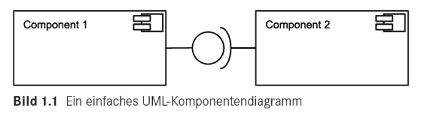

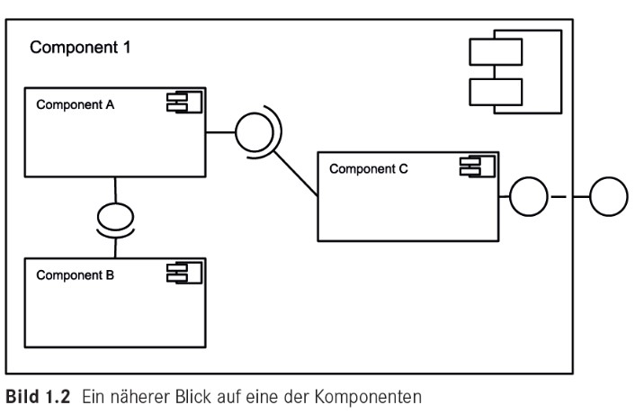

### Abläufe

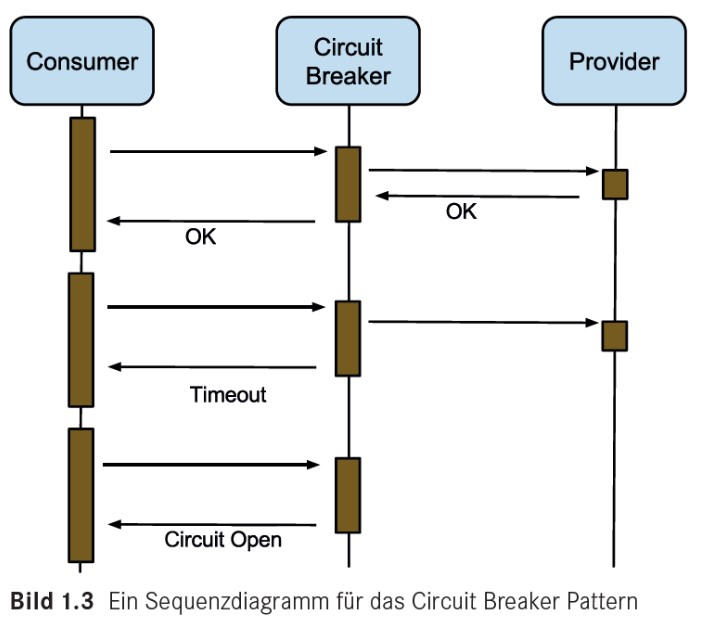

### Anforderungen
FURPS
- Funkctionality
- Usability
- Reliability
- Performance
- Supportability

Das bedeutet:
- funktionale Anforderungen des Kunden
- nicht funktionale Anforderungen
    - Wartbarkeit (Änderbarkeit, Erweiterbarkeit, Ersetzbarkeit)
    - Zuverlässigkeit (Stabilität, Wiederherstellbarkeit)
    - Skalierbarkeit
    - Leistung (Geschwindigkeit, Effizienz, Antwortzeiten)
    - Usability (Benutzbarkeit, Erlernbarkeit)

## Prinzip des hierarchischen Aufbaus von Softwarearchitekturen

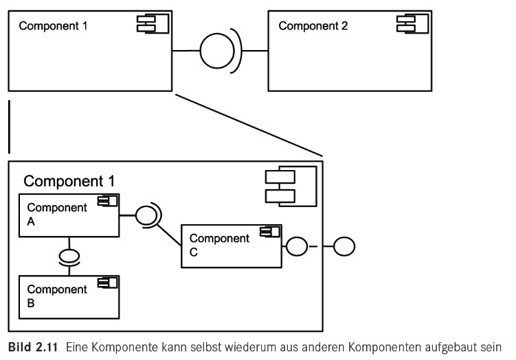

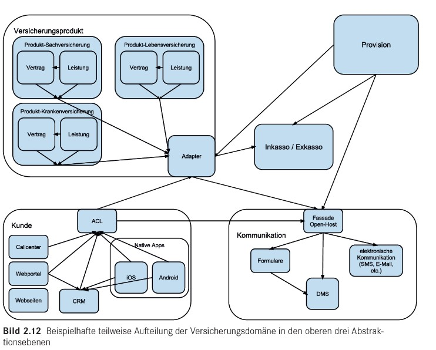

# C4 (it der Sprengstoff)

Das C4-Modell dient der Darstellung der Architektur eines Software-Systems.

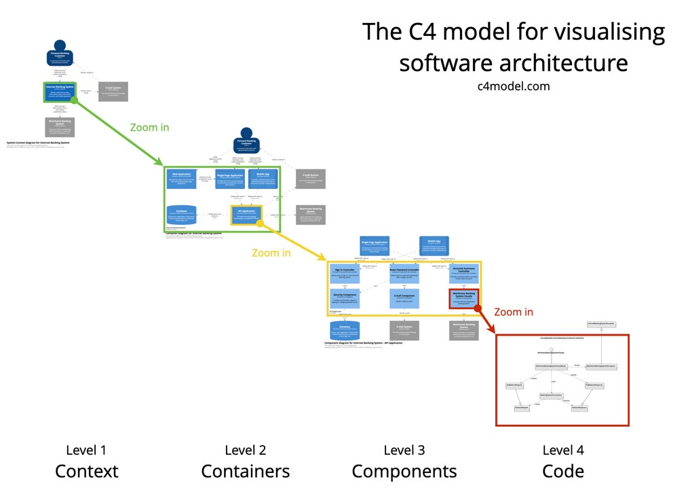

## Level 1: Context-Diagramm
zeigt das System und seine Beziehung zu Benutzern und anderen Systemen

Ist der Startpunkt für die Diagramme und die Software-Dokumentation. Erlaubt einen Blick auf das "Große Ganze".

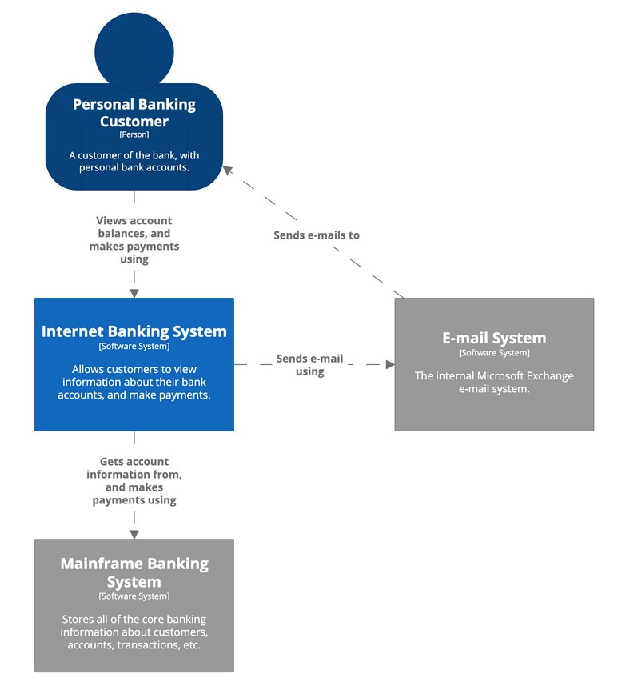

## Level 2: Container-Diagramm
zerlegt ein System in zusammenhängende Container. Ein Container repräsentiert eine Anwendung oder einen Datenspeicher

Wenn man den Überblick über die IT-Umwelt erlangt hat, kann man näher in die Anwendung zoomen. Ein Container kann so was sein wie einer server-seitige Web-Applikation, eine single-page-Applikation, eine Desktop-Applikation, eine Mobile App, ein Datenbank Schema, ein Datei-System, etc.

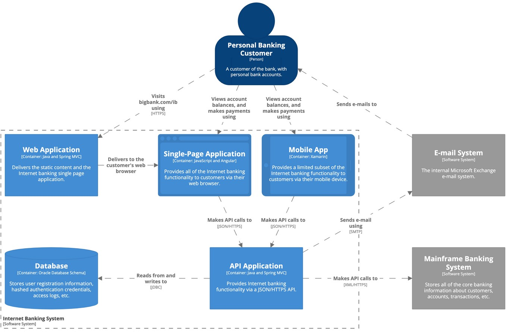

## Level 3: Component-Diagramm
zerlegt einen Container in zusammenhängende Komponenten. Zeigt die Beziehungen zu anderen Containern oder anderen Systemen

In einem Container befinden sich verschiedene Komponenten. In jedem Container können die strukturellen Blocks und deren Interaktionen gesehen werden.

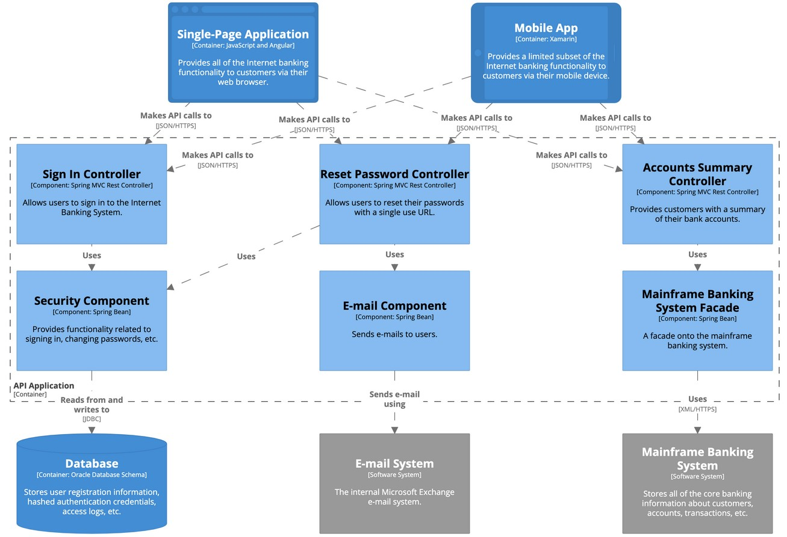

## Level 4: Code-Diagramm
bieten zusätzliche Details der Komponenten

Wenn man in eine Komponente zoomt, wird dessen Implementierung sichtbar. Dies kann mit UML-Klassendiagrammen, Entity-Relationship-Diagrammen oder ähnlichem dargestellt werden.

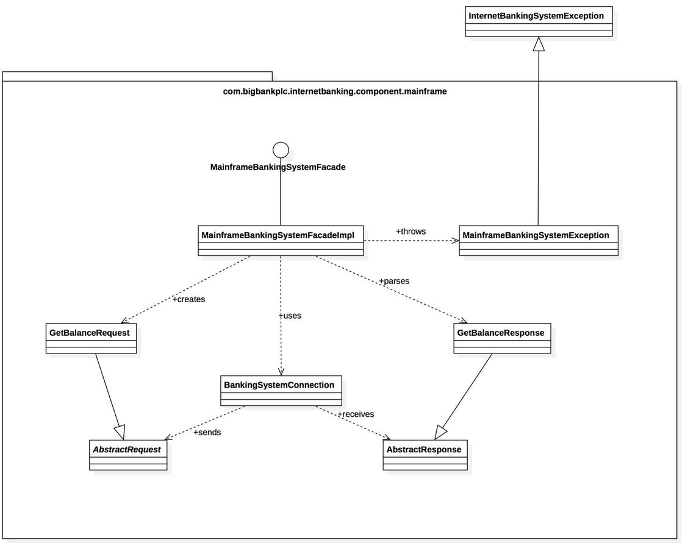

# Entscheidungsbaum-Software-Architektur

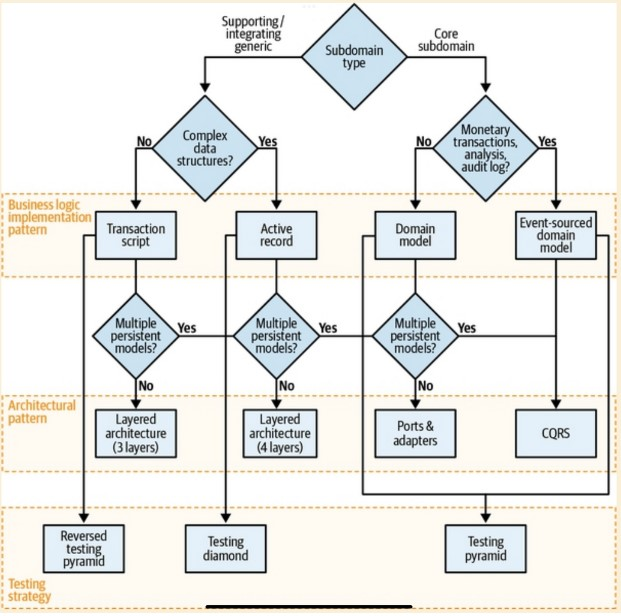

# Layered Architecture

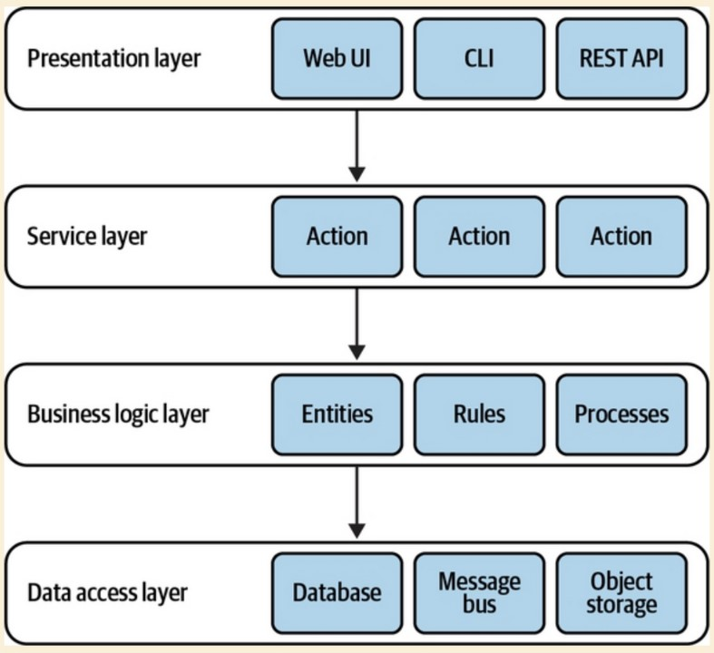

# Ports and Adapters

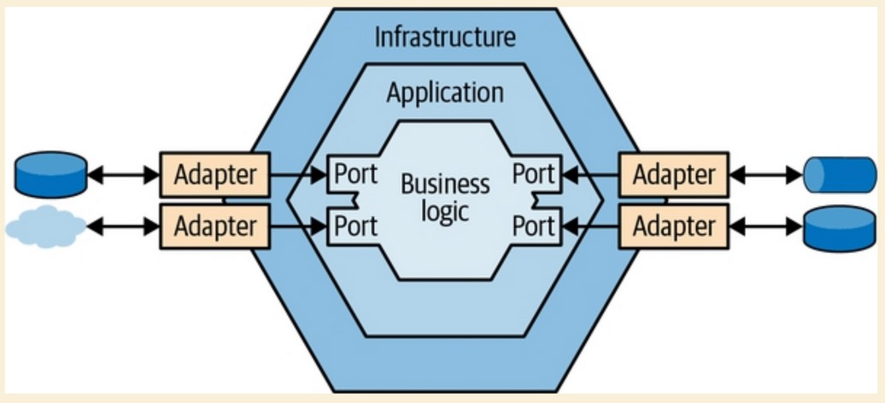

# DDD Domain-Driven-Design

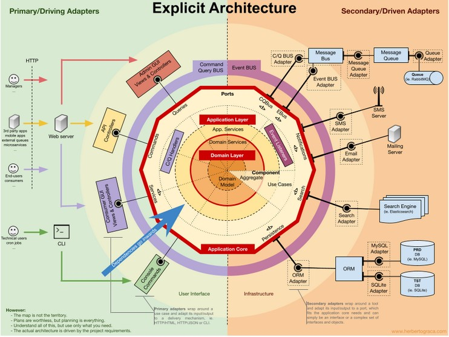

