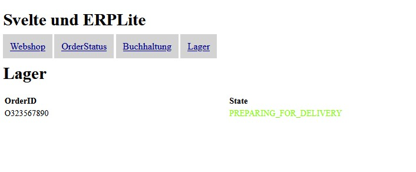
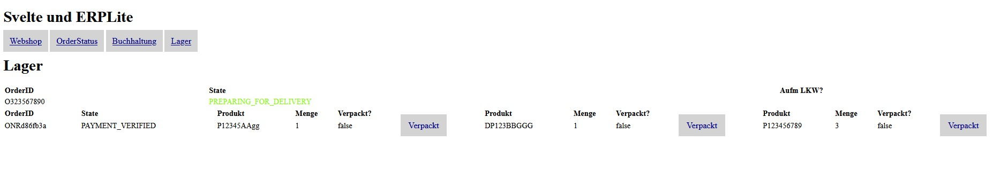

# Aufgabe Makroarchitektur Teil 1

## Abgabe des Architekturanalyse des bestehenden erplite-Backends

### Bestellung aufgeben

Wenn eine neue Bestellung ohne Fehler aufgegeben wird, wird im OrderRestController OrderResponse orderResponse = orderCommandService.handle(placeOrderCommand); aufgerufen. Der Methoden-Kopf wird im Interface OrderCommandService deklariert. Die Klasse OrderCommandServiceImpl implementiert dieses Interface. In dieser Klasse wird dir Order validiert und die Order wird als orderToInsert erstellt. Mit Optional<Order> orderOptional = this.orderRepository.insert(orderToInsert); wird die Order mit dem Status PLACED in die Datenbank gespeichert. Über das Interface OrderOutgoingMessageRelay wird eine Nachricht gesendet. Die Klasse OrderOutgoingSpringMessageRelayImpl implementiert das Interface. In der publish(OrderPlaced-Event)-Methode wird ein OrderPlacedSpringEvent ausgelöst. Dieser Event löst einen OrderPlacedEvent aus. Die Event-Listener-Klassen sind StockIncomingMessageHandler, ErpliteApplication und IncomingOrderPackedSpringEventHandler.

### Bestellung auf bezahlt setzen

Im OrderRestController wird mittels "/orders/checkpayment/{orderid}" eine REST-Schnittstelle angeboten über die eine Order auf "PAYMENT_VERIFIED" gesetzt werden kann. Dies passiert über das gleiche Interface wie die Bestellung aufgegeben wird. Wenn die Bezahlung gesetzt wurde, wird in der Klasse OrderCommandServiceImpl eine andere handle()-Methode aufgerufen, diesmal mit einem OrderPaymentCheckCommand-Objekt. Mittels orderStateTransitionTo() aus der Orders-Klasse wird der OrderState auf PAYMENT_VERIFIED gesetzt. Die Order in der Datenbank wird upgedatet.

### Packliste generieren

Wenn in der Klasse OrderCommandServiceImpl die Methode handle(PlaceOrderCommand) aufgerufen wird, wird für jedes CartItem ein neues LineItem erstellt. Diese LineItems können mit der Order abgerufen werden. Die LineItems sind Teil des Order-JSON-Objektes. Mit dieser Liste können die Packlistenitems erstellt werden.

### Packlistenitems abhaken

Wenn der Order-Status auf PAYMENT_VERIFIED gesetzt ist. Wurde die Packliste erstellt. Nun können die einzelnen Items dieser Packliste angezeigt werden. Mit "/stock/setPackedForPacking/{id}" wird der Status eines Items auf PACKED gesetzt. Wenn alle Items verpackt wurden, wird ein Event ausgelöst und der Order-State wird auf PREPARING_FOR_DELIVERY gesetzt. Das passiert in der Klasse OrderIncomingMessagesAdapter.

### Bestellung auf IN_DELIVERY setzen wenn alle Packlistenitems gepackt sind

In der Klasse PackingRestController wird bei jedem "/setPackedForPacking/{id}"-Aufruf geprüft ob alle Items einer Order bereits verpackt wurden. Wenn dies der Fall ist, wird die Methode publishOrderPackedSpringEventForOrderId()-Methode aufgerufen. Diese erzeugt ein neues OrderPackedSpringEvent die wiederum ein neues Event erzeugt, das über den ApplicationEventPublisher an alle geschickt wird, die lauschen.

Ich kenn mich jetzt aus wo was passiert, aber im Detail komm ich mit den EventHandlern und EventListenern noch nicht klar...

## Frontend

### vollständiger Code des gesamten Backends

Code ist in dieser Abgabe dabei.

### Screenshots und Beschreibung der Funktionalität
### Codeerklärgungen für implementierte Anwendungsfälle

Ich erkläre den Code mit den Screenshots

Das ist meine Startseite mit den 4 Reitern.

Der Webshop sieht wie folgt aus:

Im OrderStatus werden alle Bestellungen mit ihrem jeweiligen Status angezeigt. Nach dem Start des Programms ist nur die erste Bestellung sichtbar.

Im Buchhaltungs-Reiter kann die aktuelle Bestellung manuell auf "PAYMENT_VERIFIED" gesetzt werden.

In der Lager-Ansicht wird noch keine Bestellung angezeigt. Die Bestellung scheint hier erst auf wenn sie bezahlt wurde.

Wenn in der Buchhaltung die "Bezahlung erfolgt" ist, verschwindet die Bestellung aus dieser Ansicht und wird nun im Lager angezeigt.

Dafür scheint sie jetzt im Lager mit den einzelnen Artikeln auf.

Der OrderStatus hat sich auf "PAYMENT_VERIFIED" geändert.

Wenn nun im Lager auf den "Verpackt"-Link geklickt wird, änder sich der Status des jeweiligen Artikels bei "Verpackt?" auf true

Wenn alle Artikel der Bestellung verpackt sind, wird der OrderStatus auf "PREPARING_FOR_DELIVERY" gesetzt.

Dies ist auch im OrderStatus zu sehen

#### Neue Bestellung

Wenn in der Webshop-Ansicht auf die Buttons "In den Warenkorb" geklickt wird, wird der jeweilige Artikel in den Warenkorb verpackt. Bei mehrmaligem Klicken, wird die Menge im Warenkorb erhöht.

Beim Klick auf "Bestellung aufgeben" wird der Warenkorb geleert und das ganze Spiel geht von vorne los.

Wenn "Bezahlung erfolgt" bei der neuen Bestellung geklickt wurde. Erscheint sie im Lager.

Die Optik der Benutzeroberfläche ist nicht gerade schön, aber das ist, denke ich, auch nicht das Ziel dieser Übung.

